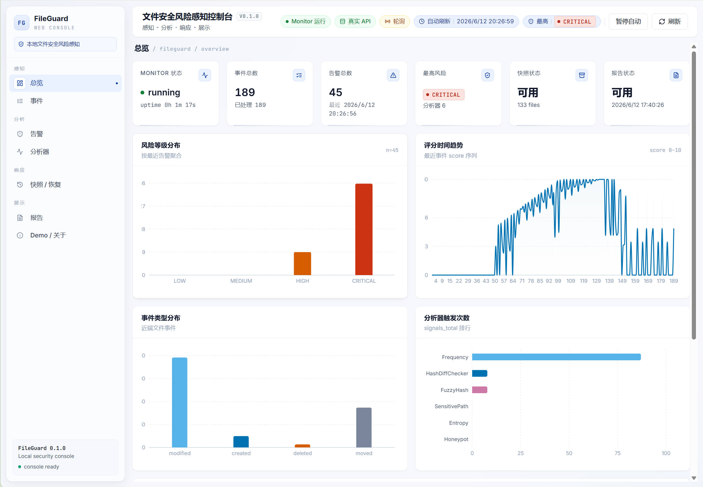
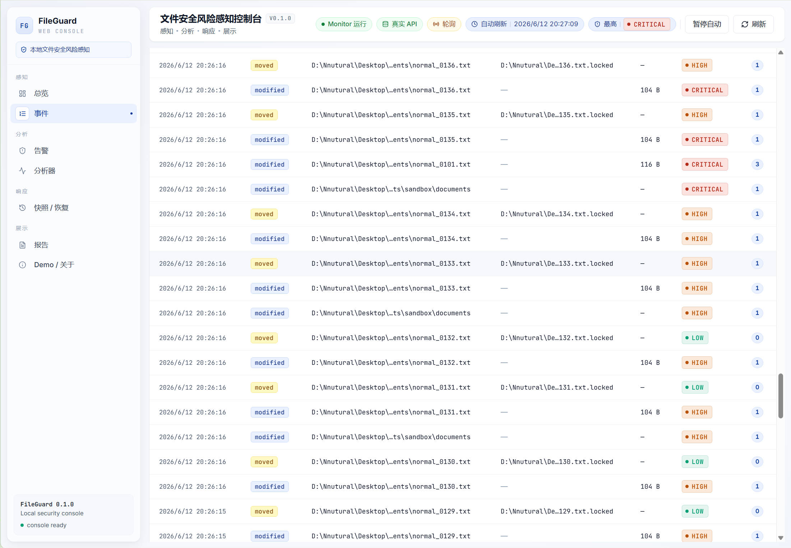
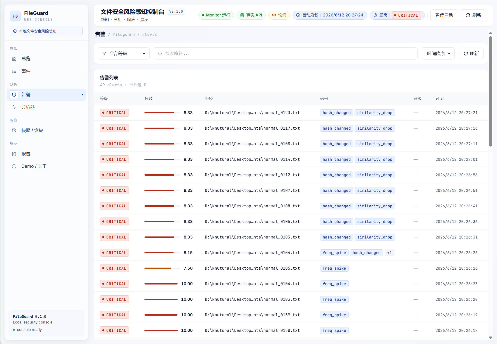
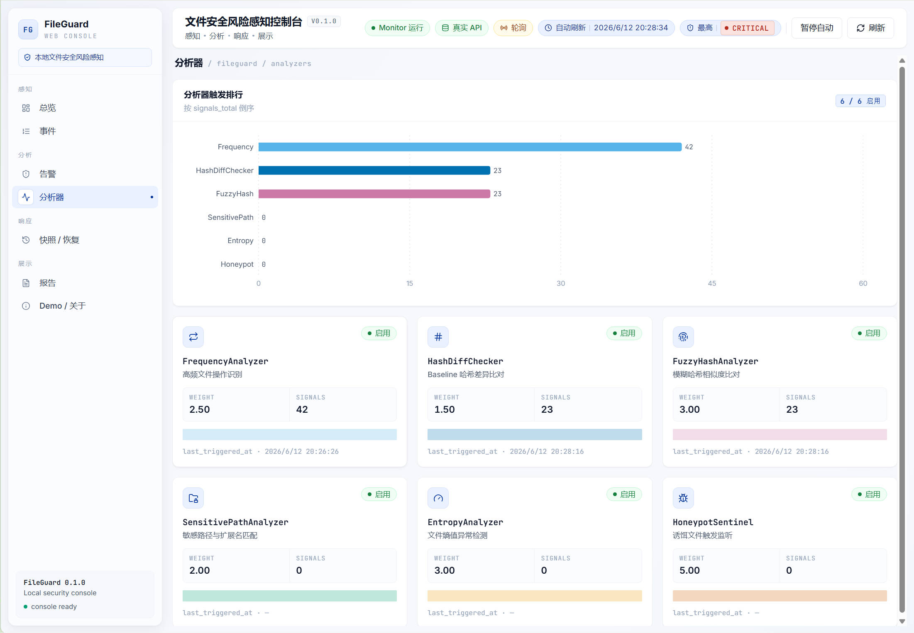
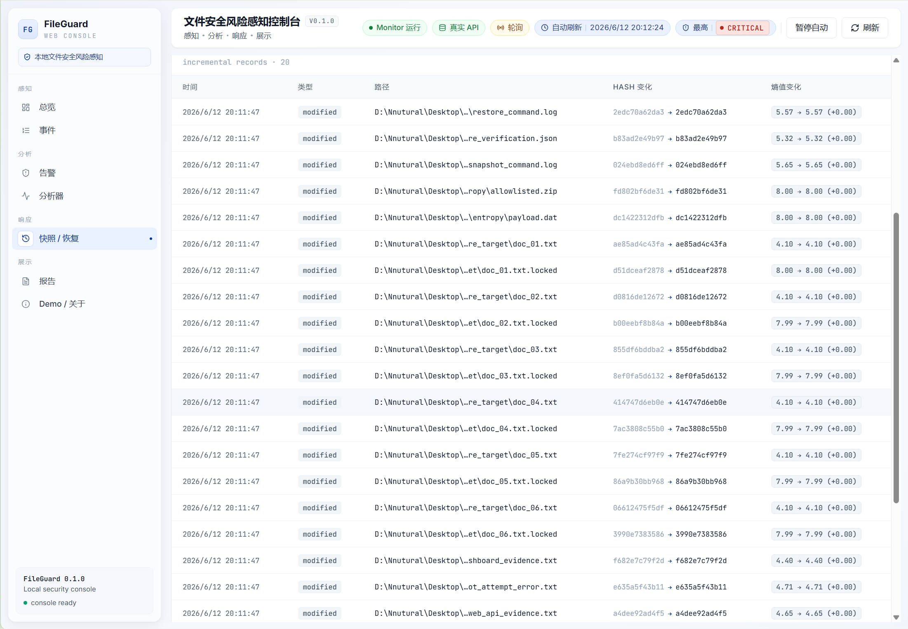
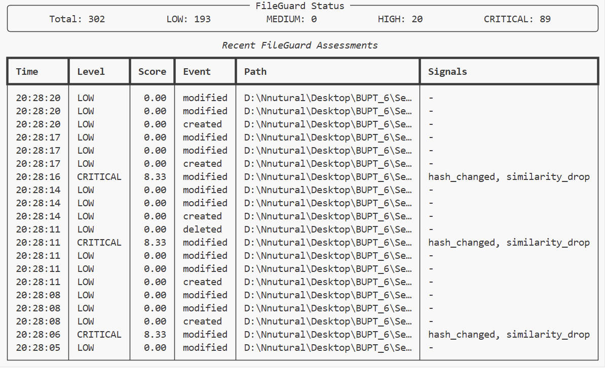
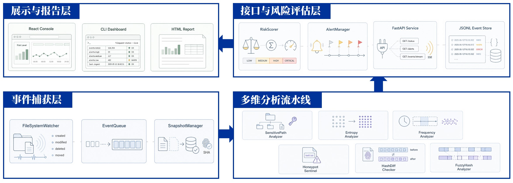
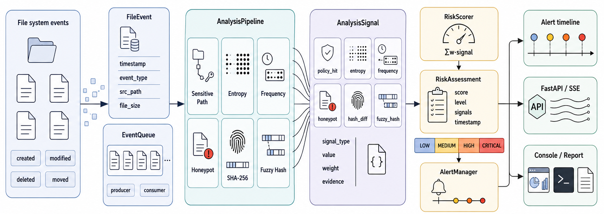
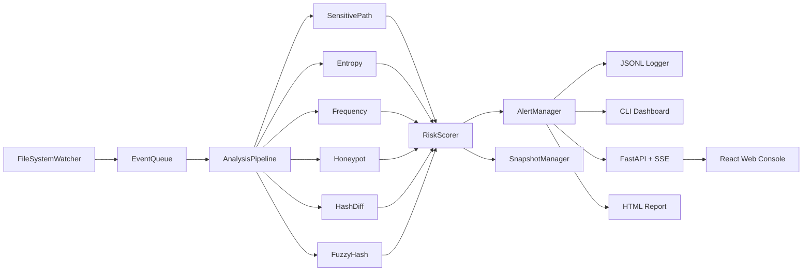

# FileGuard

<p align="center">
  <strong>基于多维行为分析的文件安全风险感知与防护验证系统</strong>
</p>

<p align="center">
  <a href="#快速开始">快速开始</a> ·
  <a href="#界面预览">界面预览</a> ·
  <a href="#系统架构">系统架构</a> ·
  <a href="#api">API</a> ·
  <a href="#测试">测试</a>
</p>

<p align="center">
  
  
  
  
  
</p>



FileGuard 是一个面向本地文件安全实验与防护验证的完整工程。它通过文件系统事件捕获、六类行为分析器、加权风险评分、告警升级、快照恢复、FastAPI 服务和 React 控制台，把“文件变化是否异常、风险来自哪里、是否可以恢复”串成一条可观测的闭环。

项目适合用于安全编程课程实验、勒索软件行为模拟、敏感文件访问检测、文件完整性监控原型，以及本地防护策略的可视化验证。

## 功能亮点

- **多维检测**：内置敏感路径、Shannon 熵、滑动窗口频率、蜜罐文件、SHA-256 哈希差异、模糊哈希相似度 6 类分析器。
- **风险评分**：将多路信号归一化后加权聚合，输出 `LOW`、`MEDIUM`、`HIGH`、`CRITICAL` 四级风险。
- **实时监控**：基于 `watchdog` 监听文件创建、修改、删除、移动，并通过 `rich` 提供终端实时面板。
- **Web 控制台**：React 控制台展示概览、事件流、告警、分析器状态、快照恢复和报告状态。
- **API 与 SSE**：FastAPI 暴露状态、事件、告警、分析器、快照和报告接口，并支持 Server-Sent Events 实时推送。
- **快照与恢复**：支持基线快照、增量快照、备份文件和恢复校验，适配本地安全演示场景。
- **报告输出**：基于 Jinja2 生成 HTML 安全分析报告，便于归档实验结果。
- **安全实验边界**：内置 demo 只写入 `experiments/sandbox/`，默认自动恢复为 dry-run。

## 界面预览

### Web 控制台

| 风险概览 | 事件流 |
| --- | --- |
|  |  |

| 告警列表 | 分析器排行 |
| --- | --- |
|  |  |

| 快照与恢复 | CLI 实时面板 |
| --- | --- |
|  |  |

## 系统架构

FileGuard 的实验报告中给出了两类架构视图：一张强调系统分层，一张强调事件从捕获到告警展示的运行时数据流。







FileGuard 分为四层：

| 层级 | 组件 | 说明 |
| --- | --- | --- |
| 事件捕获层 | `FileSystemWatcher`、`EventQueue`、`SnapshotManager` | 监听文件系统事件，维护快照与备份 |
| 分析流水线 | `AnalysisPipeline`、`analyzers/*` | 产生元数据级别的分析信号 |
| 风险评估层 | `RiskScorer`、`AlertManager`、FastAPI | 计算风险等级，管理告警与升级策略 |
| 展示层 | CLI、React 控制台、HTML 报告 | 面向实验演示和结果归档 |

## 快速开始

### 环境要求

- Python 3.10+
- Node.js 18+，仅 Web 控制台需要
- Windows PowerShell、macOS 或 Linux shell

### 安装后端

```bash
git clone <your-repo-url>
cd FileGuard
python -m venv .venv
source .venv/bin/activate
pip install -e .
cp config.example.yaml config.yaml
```

Windows PowerShell:

```powershell
git clone <your-repo-url>
cd FileGuard
python -m venv .venv
.\.venv\Scripts\Activate.ps1
pip install -e .
Copy-Item config.example.yaml config.yaml
```

### 运行安全 Demo

Demo 会在 `experiments/sandbox/` 中生成正常操作、敏感路径、高熵文件、批量修改、告警升级、快照恢复和报告文件等实验数据。

```bash
python -m fileguard demo --config config.example.yaml
```

也可以直接运行脚本：

```bash
python experiments/run_demo.py --config config.example.yaml
```

### 启动监控与 API

```bash
fileguard monitor --config config.yaml --verbose --serve-api
```

默认 API 地址为 `http://127.0.0.1:8000`。

### 启动 Web 控制台

```bash
cd frontend
npm install
npm run dev
```

Vite 默认地址为 `http://localhost:5173`。如果后端不在线，前端会进入显式 Demo 数据模式，仍可展示完整界面结构。

## CLI

| 命令 | 说明 |
| --- | --- |
| `fileguard monitor -c config.yaml --serve-api` | 启动文件监控、风险分析、CLI 面板和 API |
| `fileguard snapshot -c config.yaml` | 为监控目录建立基线快照 |
| `fileguard restore -c config.yaml --from-snapshot <path>` | 从快照恢复文件并校验哈希 |
| `fileguard report -c config.yaml` | 从 JSONL 事件日志生成 HTML 报告 |
| `fileguard demo -c config.example.yaml` | 运行安全演示流程 |

## API

启动 `--serve-api` 后可访问以下接口：

| Method | Endpoint | 说明 |
| --- | --- | --- |
| `GET` | `/api/status` | 运行状态、事件总数、最高风险、快照和报告可用性 |
| `GET` | `/api/events` | 最近文件事件和对应风险信息 |
| `GET` | `/api/alerts` | 告警时间线、信号详情和按等级聚合 |
| `GET` | `/api/analyzers` | 分析器启用状态、权重、触发次数 |
| `GET` | `/api/snapshots` | 快照、备份、恢复、增量记录状态 |
| `GET` | `/api/reports` | 报告文件状态 |
| `POST` | `/api/reports` | 触发 HTML 报告生成 |
| `GET` | `/api/stream` | SSE 实时状态、事件和告警流 |

示例：

```bash
curl http://127.0.0.1:8000/api/status
curl -X POST http://127.0.0.1:8000/api/reports
```

## 配置

核心配置位于 `config.yaml`：

| 配置段 | 说明 |
| --- | --- |
| `fileguard.watch_dirs` | 被监控的目录列表 |
| `fileguard.exclude_patterns` | 排除文件模式 |
| `fileguard.analyzers.*` | 各分析器开关、权重和阈值 |
| `fileguard.scoring.levels` | 风险等级区间 |
| `fileguard.alerting` | 告警冷却时间和升级规则 |
| `fileguard.snapshot` | 基线、备份、增量快照配置 |
| `fileguard.auto_restore` | 自动恢复开关和 dry-run 模式 |
| `fileguard.output` | JSONL 日志、HTML 报告和面板刷新配置 |
| `fileguard.api` | API 地址、端口和 CORS 配置 |

默认配置监控 `./experiments/sandbox`，适合直接复现实验。

## 项目结构

```text
FileGuard/
├── README.md
├── pyproject.toml
├── config.example.yaml
├── config.yaml
├── docs/
│   ├── architecture.md
│   ├── demo_guide.md
│   ├── frontend_guide.md
│   └── assets/screenshots/
├── experiments/
│   ├── run_demo.py
│   ├── run_acceptance.py
│   ├── simulate_normal.py
│   ├── simulate_ransomware.py
│   ├── simulate_sensitive.py
│   └── sandbox/
├── frontend/
│   ├── src/
│   ├── package.json
│   └── vite.config.ts
├── src/fileguard/
│   ├── api/
│   ├── analyzers/
│   ├── capture/
│   ├── output/
│   ├── scoring/
│   ├── cli.py
│   ├── config.py
│   ├── models.py
│   └── pipeline.py
├── templates/
│   └── report.html
└── tests/
```

## 测试

后端测试：

```bash
python -m pytest
```

前端类型检查和构建：

```bash
cd frontend
npm install
npm run typecheck
npm run build
```

## 实验产物

Demo 和验收脚本会生成以下典型产物：

- `experiments/sandbox/outputs/demo_events.jsonl`
- `experiments/sandbox/outputs/demo_alerts.json`
- `experiments/sandbox/outputs/demo_report.html`
- `experiments/sandbox/outputs/demo_api_status.json`
- `experiments/sandbox/outputs/demo_api_events.json`
- `experiments/sandbox/outputs/demo_api_alerts.json`
- `experiments/sandbox/outputs/demo_api_analyzers.json`
- `experiments/sandbox/outputs/demo_api_snapshots.json`

## 文档

- [系统架构](docs/architecture.md)
- [Demo 指南](docs/demo_guide.md)
- [前端指南](docs/frontend_guide.md)
- [实验记录](docs/experiment_log.md)
- [最终交付说明](docs/final_delivery.md)

## 安全说明

本项目用于教学实验和防护验证。内置 demo 只操作 `experiments/sandbox/`，请不要将真实敏感目录配置为测试目标。自动恢复默认关闭，且默认使用 dry-run 模式。

## License

MIT
